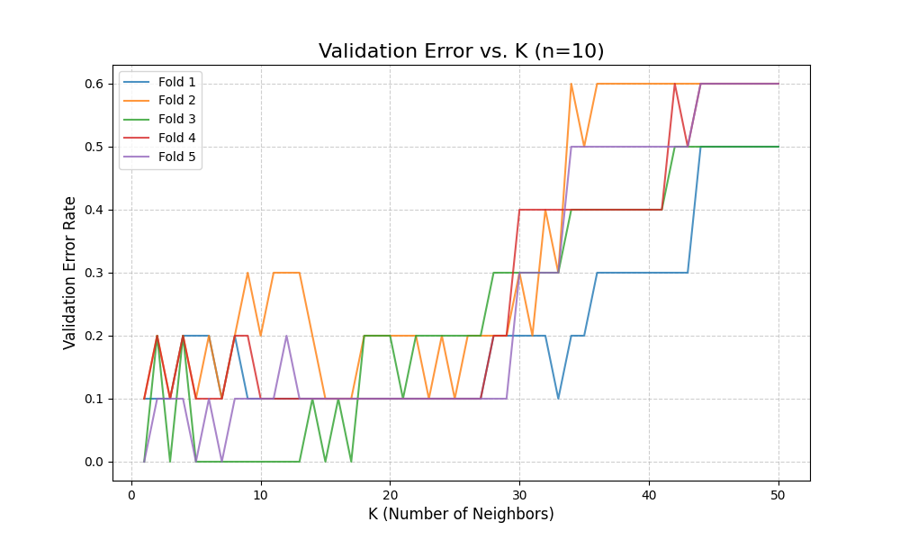
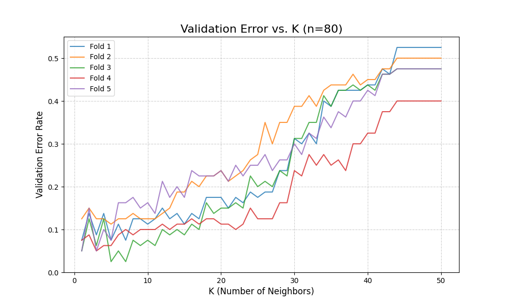
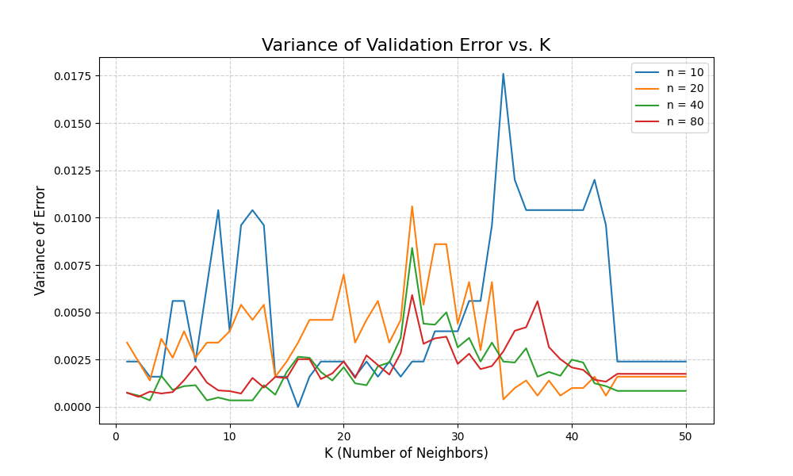
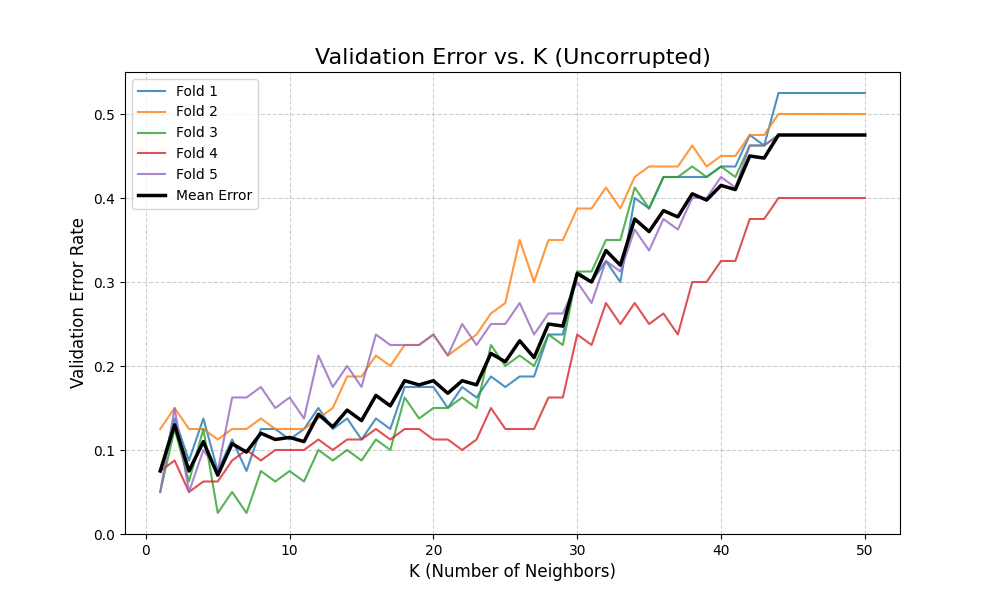
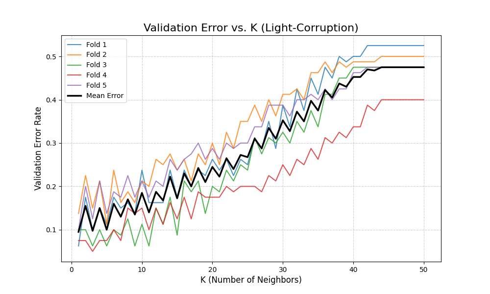
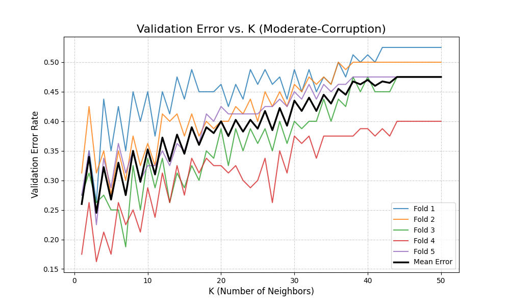
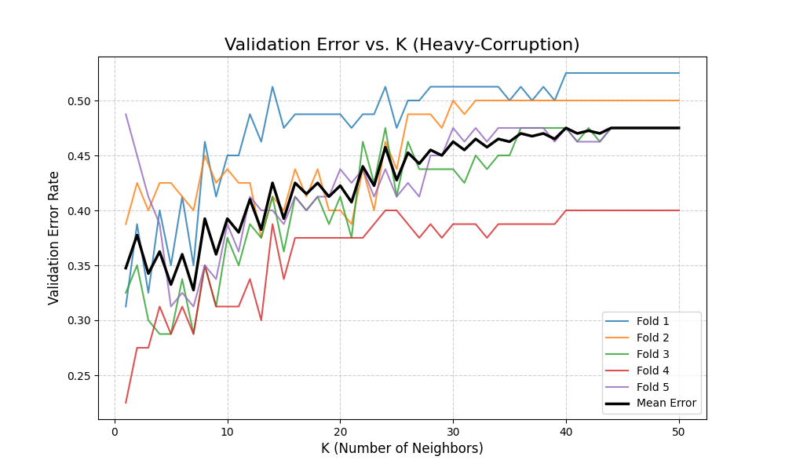

# K-Nearest Neighbors (K-NN) from Scratch

> **Project Summary:** This is a from-scratch implementation of the K-NN algorithm in Python. The project goes beyond just building the classifier to scientifically analyze its performance. It uses the MNIST dataset to:
> 1.  Prove the importance of **validation set size** for a stable model.
> 2.  Test the model's **robustness** and the impact of the **bias-variance trade-off** on noisy data.

### 1. Core Technical Implementation

To ensure high performance, the entire algorithm was implemented without `for` loops, relying on vectorized NumPy operations.

* **Vectorized Distance Matrix:** The `(m x n)` squared Euclidean distance matrix ($D^2 = x^T x - 2x^T z + z^T z$) was calculated in a single operation using NumPy's broadcasting.
* **Vectorized Predictions:** All K-value predictions (for K=1 to 50) were computed at once using `np.argsort` to get neighbor indices, and `np.cumsum` on `{-1, 1}` labels to perform the "majority vote" efficiently.

---

### 2. Analysis 1: The Importance of Validation Set Size (Task #1)

This experiment tested how the *size* of the validation set (`n`) affects the reliability of the error estimate.

#### Finding:
As the validation set size (`n`) increases, the variance of the error estimate drops significantly. A small `n=10` gives chaotic, unreliable results, while `n=80` gives a stable, trustworthy estimate.

#### Evidence:
This is clearly visible when comparing the 5 validation folds for `n=10` vs. `n=80`. The `n=80` plot shows the 5 folds (the thin lines) are tightly clustered around the mean. The `n=10` plot shows they are far apart.

| Validation Error (n=10) | Validation Error (n=80) |
| :---: | :---: |
|  |  |

The final "Variance Plot" confirms this. The **blue line (`n=10`)** is dramatically higher and spikier, proving it has the most variance, while the **red line (`n=80`)** is the lowest and flattest.

---

### 3. Analysis 2: Model Robustness to Data Corruption (Task #2)

This experiment tested how the model's performance and optimal `K` are affected by noisy, corrupted data.

#### Finding 1: As noise increases, accuracy drops significantly.
The model's best possible performance (the minimum mean error) gets progressively worse as the data becomes noisier.

| Dataset | Best Mean Error | Optimal K |
| :--- | :---: | :---: |
| **Uncorrupted** | 0.0700 | 5 |
| **Light-Corruption** | 0.0950 | 1 |
| **Moderate-Corruption**| 0.2450 | 3 |
| **Heavy-Corruption** | 0.3275 | 7 |

#### Finding 2: The Optimal K shifts to compensate for noise.
The data shows that the best `K` for a "clean" dataset (K=5) is *not* the best `K` for a "noisy" one (K=7 for heavy corruption).

This is the **bias-variance trade-off in action.**
* A noisy dataset requires a **larger K** to "smooth out" the noise.
* If `K` is too small (like `K=1`) on noisy data, the model will **overfit** to the random noise (high variance).
* By increasing `K`, the model averages over more neighbors, and the "noisy" votes get canceled out. This is why the `Heavy-Corruption` model performs best at `K=7`, finding a new "sweet spot" that balances bias and variance.

#### Evidence (All 4 Plots):

| Uncorrupted (K=5 is optimal) | Light-Corruption (K=1 is optimal) |
| :---: | :---: |
|  |  |
| **Moderate-Corruption (K=3 is optimal)** | **Heavy-Corruption (K=7 is optimal)** |
|  |  |

---

### 4. Key Takeaways & Technologies

* **Statistical:** Proved that validation set size is critical for reliable model selection and demonstrated how the optimal `K` in K-NN is a tool to manage the bias-variance trade-off, especially in the presence of noise.
* **Technical:** Demonstrated efficient, high-performance, vectorized programming in Python.

**Technologies Used:**
* Python
* NumPy
* Matplotlib
