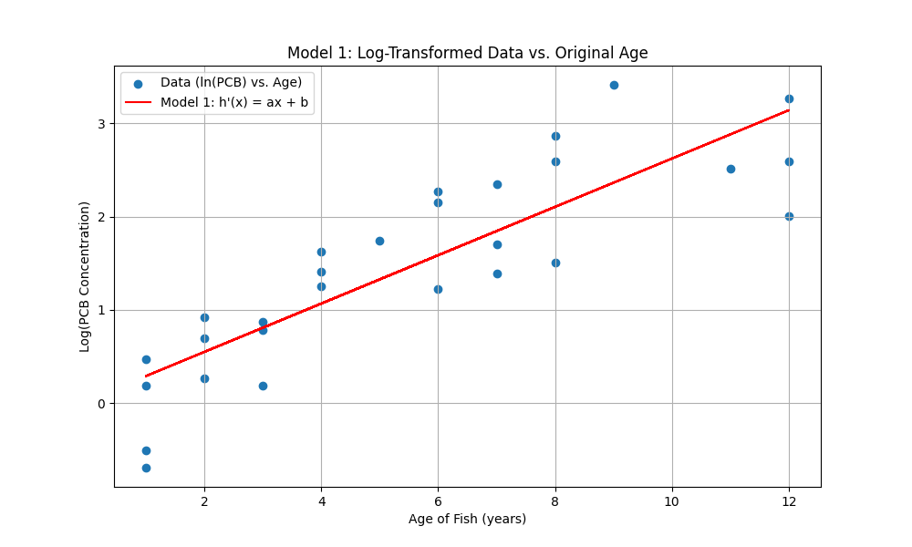
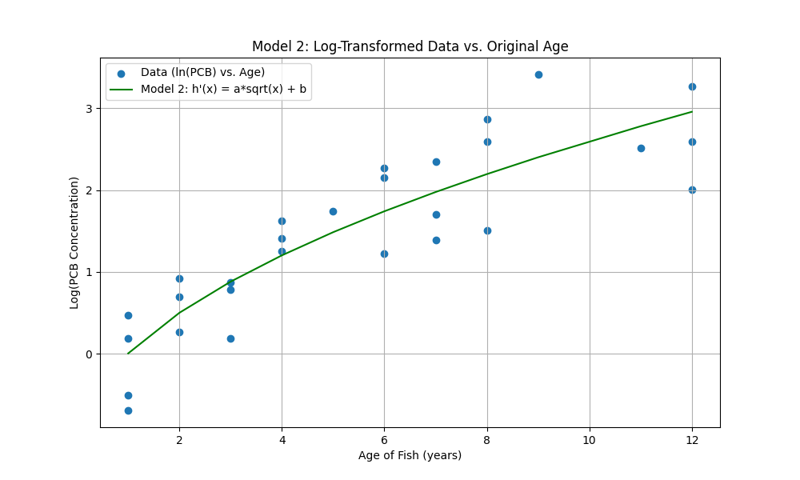

# Linear Regression: Predicting PCB in Lake Trout

> **Project Summary:** A data science project to predict PCB concentration in lake trout based on their age. This project demonstrates implementing linear regression from scratch, engineering features, and transforming data (a log-transform on the target) to fit a non-linear model.

### 1. The Challenge

The goal was to model the relationship between a fish's **age (`x`)** and its **PCB concentration (`y`)** using a real-world dataset. The underlying relationship is non-linear, so a simple straight line $y = ax+b$ is not effective.

### 2. The Approach: Linearizing the Model

I built a model of the form $h(x) = \exp(ax+b)$. By applying a **natural logarithm** to the target variable `y`, the problem becomes a simple linear regression:

$\ln(y) = ax + b$

I implemented the linear regression algorithm from scratch using the **Normal Equation** ($w = (X^T X)^{-1} X^T y$) to solve for the parameters `a` and `b`.

### 3. Model 1: Basic Linear Feature (`x`)

First, I fit the model using the original "Age" feature.

* **Model:** $\ln(y) = 0.2591 \cdot x + 0.0315$
* **Result:** This model provides a decent starting point. The plot shows the linear trend, but it's clear the data has a curve that the straight line doesn't capture.
* **$R^2$ (on log-data):** 0.7314

### 4. Model 2: Feature Engineering (`sqrt(x)`)

Second, I engineered a new feature by taking the **square root of the age (`sqrt(x)`)**. This is a common technique for data that grows quickly at first and then slows down.

* **Model:** $\ln(y) = 1.1986 \cdot \sqrt{x} - 1.1948$
* **Result:** This model is a **much better fit**. The green curve visibly follows the scatter plot more closely, especially for younger and older fish.
* **$R^2$ (on log-data):** 0.7861

---

### 5. Final Comparison & Conclusion

| Model | Features | $R^2$ (on Log-Data) | MSE (on Original Data) |
| :--- | :--- | :---: | :---: |
| Model 1 | `ax + b` | 0.7314 | 34.8356 |
| **Model 2** | `a*sqrt(x) + b` | **0.7861** | **28.0844** |

**Conclusion:**
**Model 2 is the clear winner.** By applying a simple `sqrt(x)` feature transformation, the model's $R^2$ (explanatory power) on the log-transformed data increased from 73.1% to 78.6%. More importantly, its Mean Squared Error (MSE) on the *original* data was significantly lower, proving it makes more accurate real-world predictions.

### 6. Key Takeaways

* **Statistical:** Demonstrated how to fit a non-linear model by transforming the target variable (log-transform).
* **Feature Engineering:** Proved that engineering a new feature (`sqrt(x)`) can significantly improve model performance over a basic linear feature (`x`).
* **Model Comparison:** Used $R^2$ and MSE to scientifically compare two models and select the best one.
* **Implementation:** Implemented the core linear regression algorithm using NumPy and the Normal Equation.

**Used:**
* Python
* NumPy
* Matplotlib
