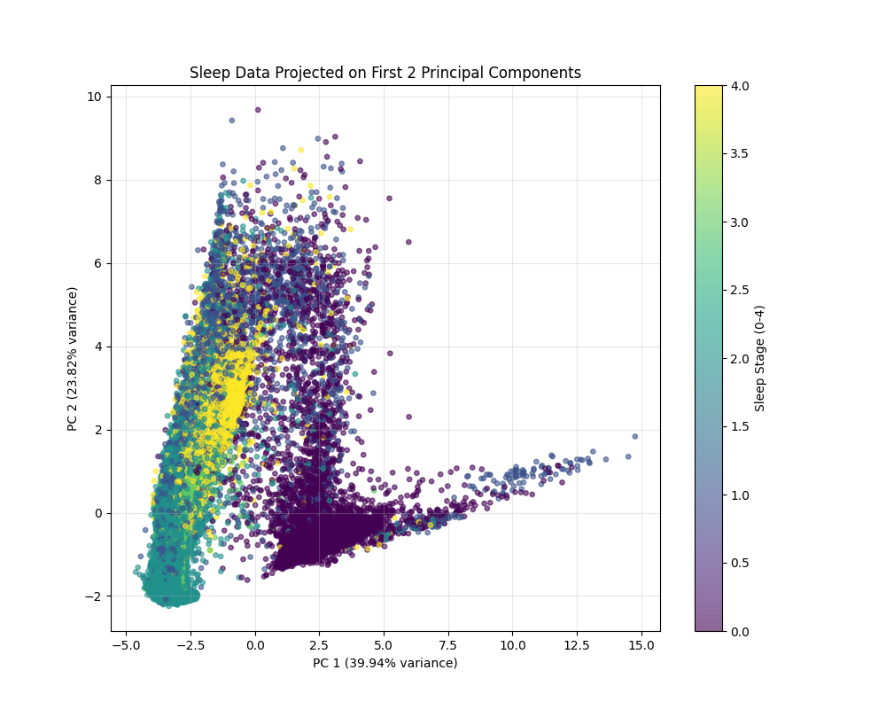
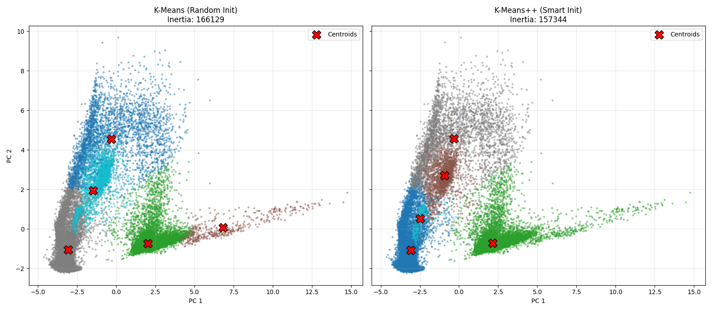

# Unsupervised Analysis: PCA & Clustering on Sleep Patterns

> **Project Summary:** An exploratory analysis of the Sleep-EDF dataset using Unsupervised Learning. I applied **Principal Component Analysis (PCA)** to reduce feature dimensionality and used **K-Means Clustering** to discover latent structures in the data without using labels.

### 1. Dimensionality Reduction (PCA)
The goal was to analyze the variance structure of the 16-feature EEG dataset. Following standard practice (zero mean/unit variance scaling), I performed PCA to transform the data to new axes that maximize variance.

* **90% Variance Threshold:** The analysis showed that only **5 components** are necessary to explain $\mathbf{90\%}$ of the total variance in the original 16-dimensional dataset. This suggests the data can be compressed significantly.
* **Visualization:** Projecting the data onto the first two Principal Components (PC1 and PC2) reveals the data's true shape and overlap between sleep stages, showing why the supervised classification task was difficult.

### 2. Clustering Analysis (K-Means Stability)

I performed 5-means clustering and compared two initialization strategies to critically evaluate the algorithm's stability and final cost.

#### Key Finding: K-Means++ is Superior
The experiment demonstrates the practical advantage of the **K-Means++** initialization method in avoiding local minima, leading to a much better clustering quality (lower cost).

| Initialization Method | Final Inertia (Cost) | Result |
| :--- | :--- | :--- |
| **Standard K-Means (Random Init)** | 166,129.21 | **Sub-optimal.** The algorithm got stuck in a local minimum, resulting in a higher cost. |
| **K-Means++ (Smart Init)** | **157,343.52** | **Optimal.** Achieved an 5.3% reduction in cost, proving K-Means++ provides a more stable, global minimum solution. |

#### Visual Evidence
The plots show the initial random centers (left) led to a clustering with higher cost, while the K-Means++ centers (right) found a better solution, reflected in the lower **Inertia** (157,343).

| K-Means (Random Init) | K-Means++ (Smart Init) |
| :---: | :---: |
|  |  |
***

### 4. Key Takeaways 

* **Portfolio Completion:** This project adds **Unsupervised Learning** skills, creating a full-stack portfolio (Supervised, Unsupervised, Deep Learning).
* **Statistical Insight:** Demonstrated the use of PCA to identify data redundancy and justify dimensionality reduction.
* **Algorithm Optimization:** Proved the practical value of **K-Means++** for ensuring stability and finding reliable cluster structures.

| Tech Stack | Analytical Skills |
| :--- | :--- |
| **Scikit-Learn** | **Dimensionality Reduction** (PCA). |
| **NumPy & Pandas** | **Clustering** (K-Means/K-Means++). |
| **Matplotlib** | **Critical Evaluation** (Inertia, Initialization). |
