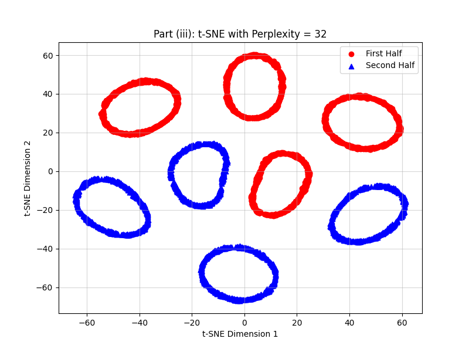
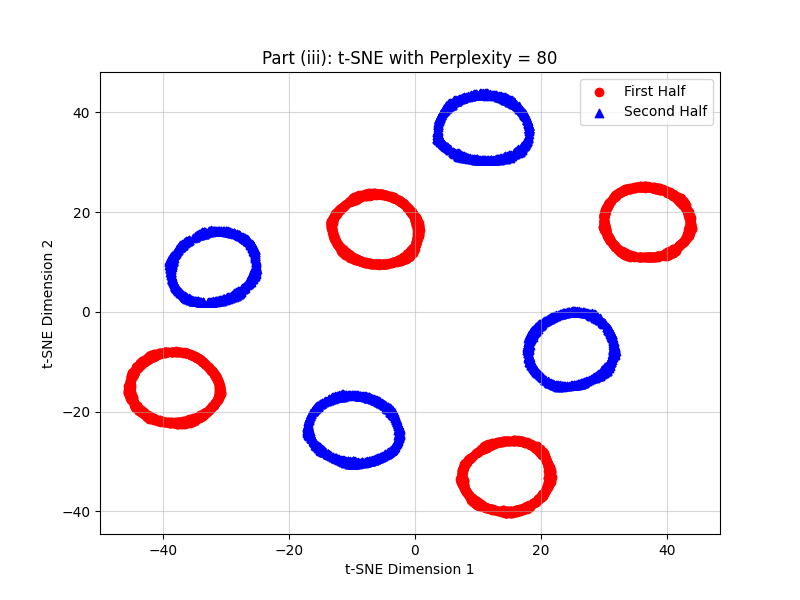
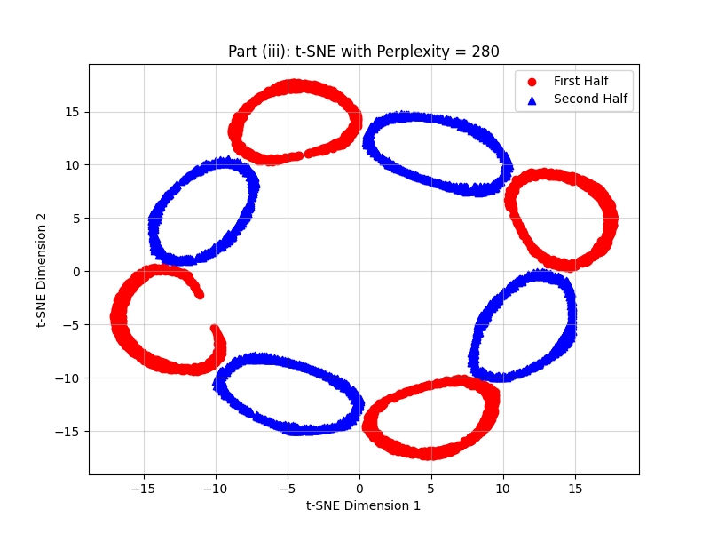

# Project: Comparative Dimensionality Reduction (PCA & t-SNE)

> **Goal:** To explore and visualize a 3-dimensional dataset (`visualization-dataset.txt`) using two primary dimensionality reduction techniques, **Principal Component Analysis (PCA)** and **t-distributed Stochastic Neighbor Embedding (t-SNE)**. This project analyzes the impact of data preprocessing (scaling) and hyperparameter tuning (perplexity) on the final 2D representations.

### 1. Initial 3D Data View

The original dataset is a 3-dimensional array. The plot below shows the initial structure, with the data split into two equal halves for visual differentiation.

---

### 2. Principal Component Analysis (PCA)

PCA is a **linear** technique that identifies the directions of maximum global variance. It was performed on both raw and standardized data.

#### Analytical Observations (Scaling Impact)

| Configuration | Analytical Observation |
| :--- | :--- |
| **PCA on Unnormalized Data** | The plot is **highly collapsed** and linear. This is because PCA is sensitive to feature scaling; the component with the highest variance (usually dominated by one feature) dictates the projection, leading to a poor, distorted representation. |
| **PCA on Normalized Data** | The projection is **more spread out**, demonstrating that Standard Scaling allows all original features to contribute equally to the principal components. However, the data still appears dense and not clearly clustered. |

---

### 3. t-SNE: Varying Perplexity Analysis

t-SNE is a **non-linear** technique designed to preserve **local structure** (neighboring points). Its output is critically dependent on the **Perplexity** hyperparameter.

#### A. t-SNE Plots (Random Initialization)

t-SNE was run on the unnormalized data using four distinct perplexity values to demonstrate the effect of the tuning parameter.

| Perplexity (k) | Plot Title | Plot Image |
| :--- | :--- | :--- |
| **32** | t-SNE with Perplexity = 32 |  |
| **80** | t-SNE with Perplexity = 80 |  |
| **180** | t-SNE with Perplexity = 180 |  |
| **280** | t-SNE with Perplexity = 280 |  |

#### B. Qualitative Comparison (PCA vs. t-SNE)

* **PCA (Linear):** Primarily captures global variance. It failed to reveal any sub-structure in the data, resulting in a dense, smeared map (even on normalized data).
* **t-SNE (Non-Linear):** All t-SNE plots successfully resolve the data into **eight distinct ring-shaped clusters**, a structure completely hidden in the PCA output. This confirms the data possesses a complex, non-linear manifold structure that t-SNE is well-equipped to visualize.

#### C. Discussion on Perplexity

The perplexity value governs the trade-off between local and global structure preservation.

* **Low Perplexity (k=32):** Provides **clear separation** and reveals the clean ring shape of the local clusters. This value appears most effective for visualizing the true sub-structure.
* **Increasing Perplexity (k=80 to k=280):** As perplexity increases, t-SNE incorporates more distant points as neighbors. The clusters start to **merge, become denser, and lose their definition**. For $k=280$, the rings are heavily compressed and less clearly separated, showing a loss of local detail in favor of the global view.

---

### Used

* **Python:** Core scripting language.
* **NumPy:** Numerical data loading and manipulation.
* **Scikit-learn (`PCA`, `TSNE`, `StandardScaler`):** Implementation of dimensionality reduction algorithms and preprocessing.
* **Matplotlib:** Data visualization and plotting.
